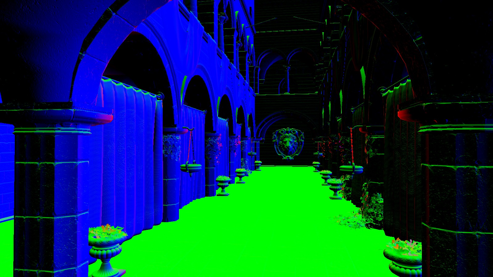
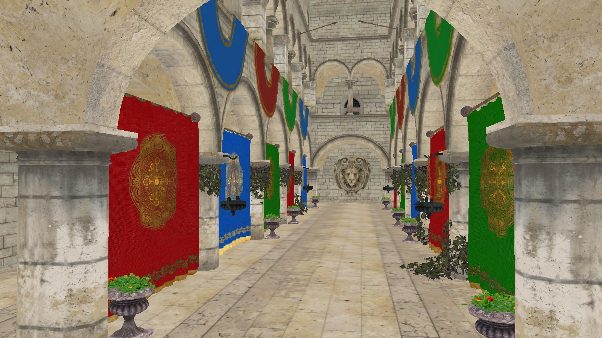
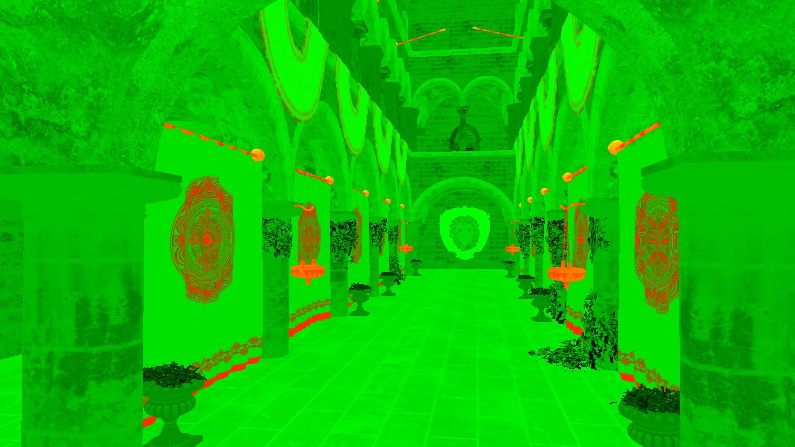
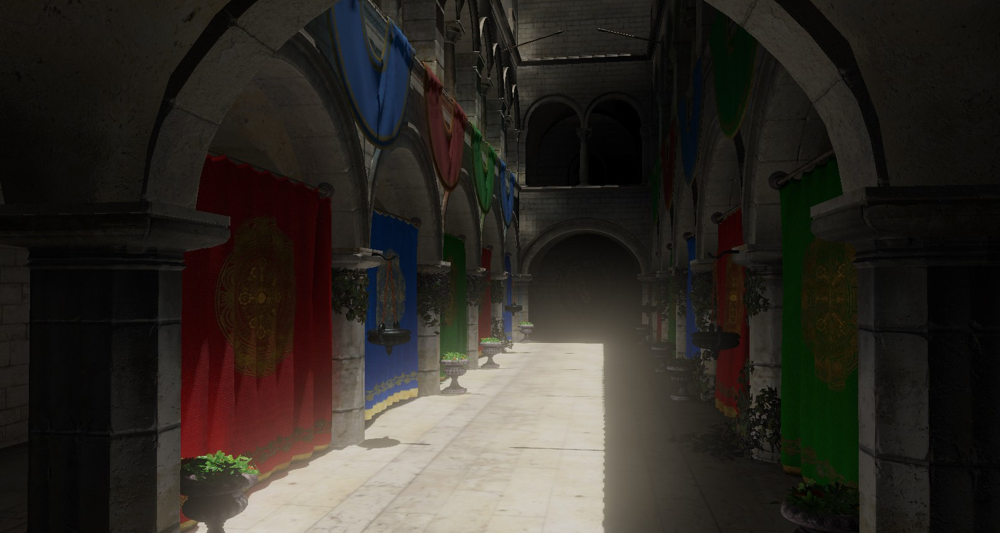
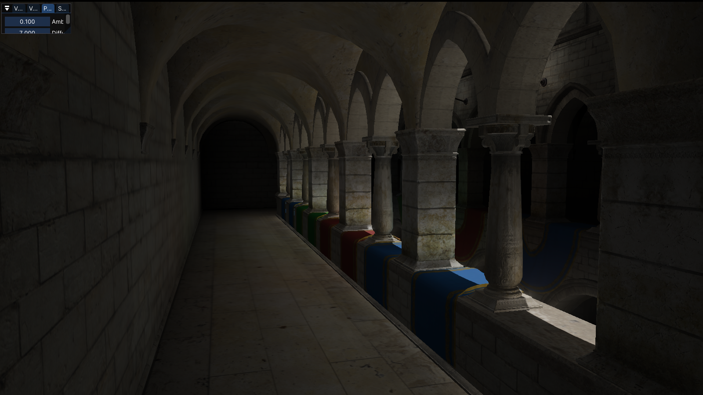
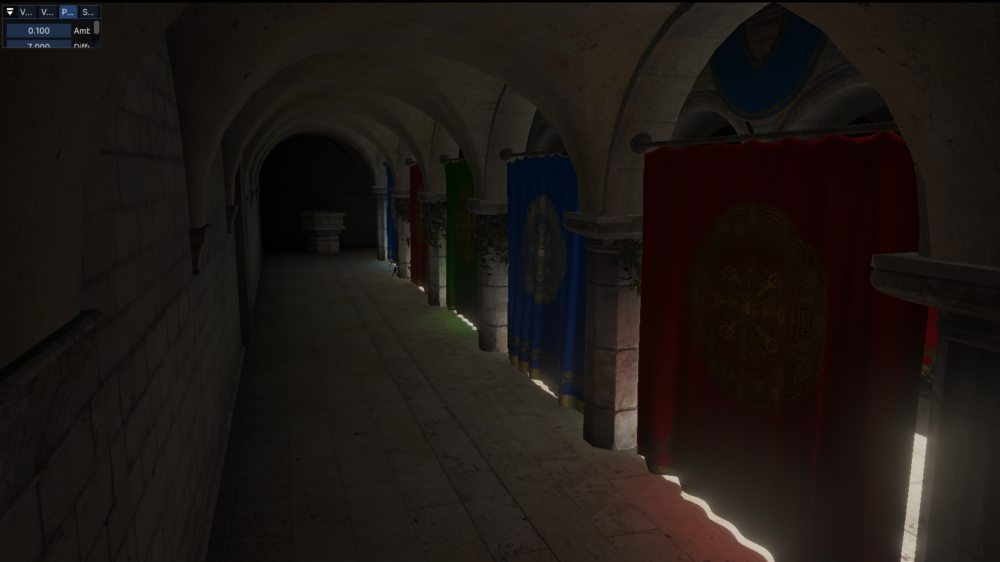

# Walker Engine 

Walker Engine is a real-time rendering engine. It is written in C++ and currently uses OpenGL as its primary graphics API. Its purpose is primarily for my own education to learn computer graphics and to use it as a platform for experimentation. 

## Build Instructions

### Requirements
* Windows 10+ x64
* Graphics card with OpenGL 4.6 support
* Visual Studio 2019 or higher
* CMake Version 3.22.2 or higher

### Build Steps
* Clone the repository using either of these two commands:
    >`git clone --recursive https://github.com/hallmluke/WalkerEngine.git` 

    >`git clone --recursive git@github.com:hallmluke/WalkerEngine.git` 

* If the repository was cloned without submodules, use this command to update the submodules:

    > `git submodule update --init`

* Generate build files using CMake. This can be done on the command line using 

    > `cmake CMakeLists.txt` 
    
    (ensure your generator is Visual Studio 2019 or higher) from the root directory or by using the CMake GUI. 
* Build the resulting solution using Visual Studio. Run either the Sandbox (for Sponza demo scene) or Walker Editor.

## Features

### Fundamentals
* OpenGL abstraction of shaders, textures, framebuffers, etc.
* Mesh loading via Assimp
* Simple Material system
* Point lighting and directional lighting
* Scene representation using entity-component system (ENTT) with saving/loading

### "Advanced" Features
* Flexible and configurable render graph system. Can define a "Render Pass" type and link several render passes dynamically at runtime.
* Deferred render pipeline with PBR support. G-Buffer is composed of an Albedo texture, a Normals texture, and a Metallic (red)/Roughness (green)/Ambient Occlusion (blue) texture.
* Global Illumination using Voxel Cone Tracing. "Probes" (bounds for the Voxel) can be placed in the scene. Scene is voxelized at load-time and cone tracing done every frame.
* Stabilized cascaded shadow maps for directional lights.
* Several post-processing effects. Bloom is implemented using Gaussian downsampling and tent filter upsampling in compute shaders. Depth of Field is implemented using a simple linear interpolation between blurred scene and "in-focus" scene based on focal length.

## Showcase

### Deferred PBR G-Buffer
Normals

Albedo

Metallic/Roughness

Final Composited Image w/ Post-Processing (Bloom, Tonemapping, etc.)

### Voxel Cone Tracing

Most of the lighting in these two shots is indirect lighting computed via Voxel Cone Tracing. The only light in this scene is the overhead directional light.

